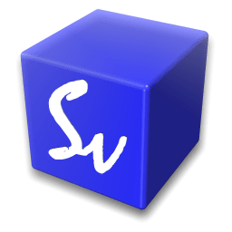

# (APPENDIX) Appendices {.unnumbered}

# Installation de la SciViews Box {#svbox}

```{block, type='note'}
À partir de l'année académique 2022-2023, la SciViews Box existe en deux versions différentes : une version SaturnCloud qui fonctionne sur le cloud, et une version locale installée à l'aide de Docker ou de Podman. Pour l'instant, nous utilisons tous la version SaturnCloud et les instructions d'installation sont accessibles depuis la page qui s'affiche lorsque vous cliquez sur le bouton bleu RStudio en haut à droite des pages du site. Cette appendice n'a donc, pour l'instant, plus de raison d'être mais il est conservé uniquement "pour mémoire".
```

```{r echo=FALSE, out.width="256px", fig.align='right'}

```
